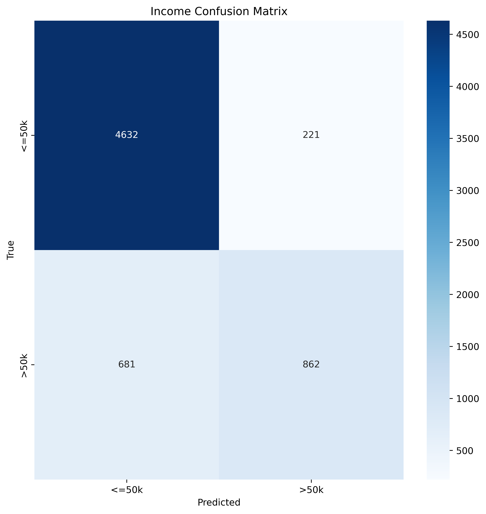
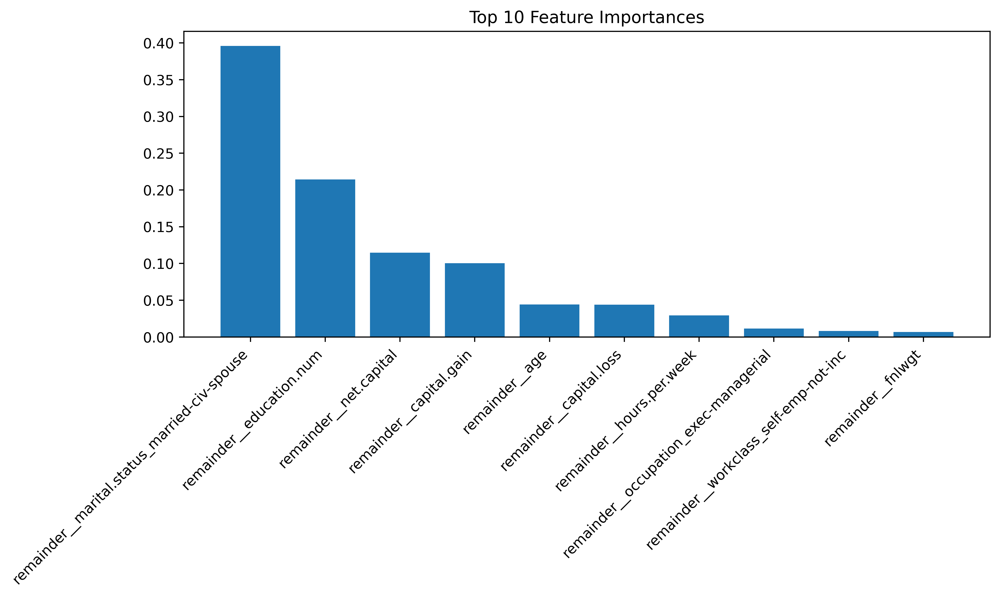
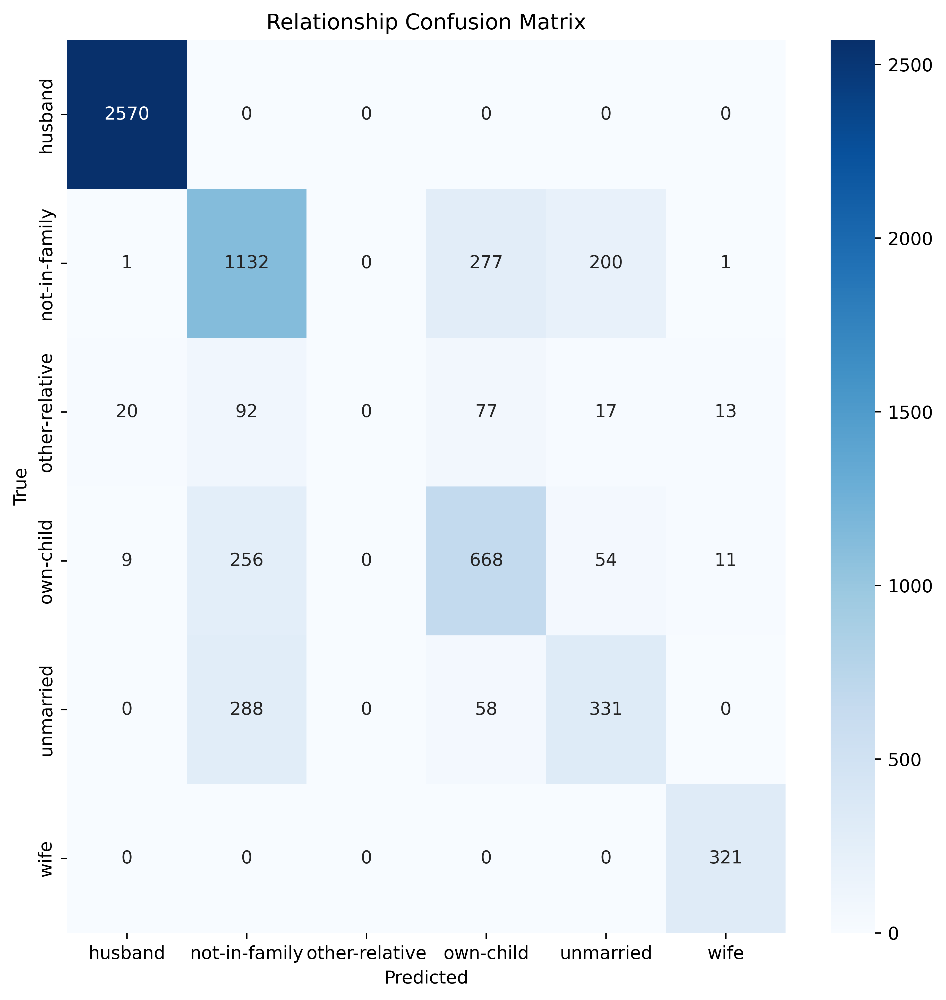
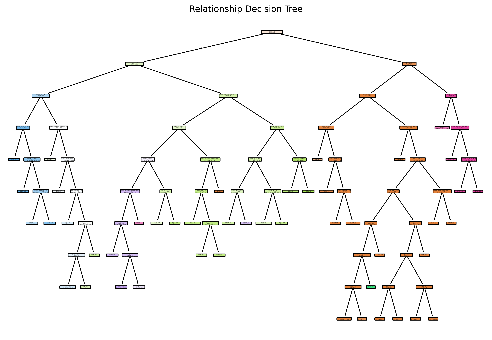

# Decision Trees for Classification on Adult Census Data

This project applies Decision Tree classifiers to predict categorical demographic attributes from the Adult Census dataset. The task involves using features such as age, education.num, marital.status etc to predict target variables like income and relationship status.

## Project Setup

### Step 1: Clone the repository

Clone the repository by running the following command in your terminal or Git Bash:

```
cd your_folder  
git clone "https://github.com/Awesome-AI-ML-DELTA25/TabularDataML.git"
```


### Step 2: Install Conda (if not already installed)

Ensure you have installed either anaconda or miniconda.
[Conda Download](https://www.anaconda.com/download/)


### Step 3: Create and activate the Conda environment

To set up the same virtual environment as used in this project, run the following command:  
` conda env create -f environment.yml `

Activate the environment:  
` conda activate weekII_env `


### Step 4: Install required packages
 ` pip install -r /path/to/requirements.txt ` 

## Overview

Decision trees split data based on feature thresholds. They are widely used for their interpretability and ability to handle both numerical and categorical data. In this project, we use decision trees to predict:

1. Income
2. Marital.status
3. Relationship
4. Workclass
5. Sex
6. Race

Points 5 and 6 cannot be predicted in an ideal world, but due to biases present in society, we try to see what the decision tree uncovers .

The dataset is preprocessed using One-Hot Encoding for categorical columns, and models are trained using scikit-learn pipelines for cleaner workflows.

## Preprocessing

| Column         | Type    | Encoding         |
| -------------- | ------- | ---------------- |
| workclass      | Nominal | One-Hot Encoding |
| marital.status | Nominal | One-Hot Encoding |
| occupation     | Nominal | One-Hot Encoding |
| relationship   | Nominal | One-Hot Encoding |
| race           | Nominal | One-Hot Encoding |
| sex            | Binary  | One-Hot Encoding |
| native.country | Nominal | One-Hot Encoding |
| income         | Binary  | One-Hot Encoding |

Dummy variables are generated and concatenated with the original dataset for model training.


## Model and Predictions

### Income

- Model: DecisionTreeClassifier (max_depth=10, min_samples_split=50)
- Evaluation:
    - Accuracy: 0.8589743589743589
    - Precision: 0.7959372114496768
    - Recall: 0.5586519766688269
    - F1: 0.6565118050266565

#### Confusion Matrix:



1. Accuracy is the best measurement for income, since any wrong classification of income is equally bad.
2. The true negatives are highest in number.
3. The recall of >50K is bad (0.56).


#### Feature Importance:



It only has the top 10 most contributing features to prevent cluttering.

#### Decision Tree:


Marital.status being married-civ-spouse has a large impace on the income, probably due to factors like tax benefits and higher investing power through combined wealth. This is also reflected in the decision tree.

### Relationship

- Model: DecisionTreeClassifier (max_depth=9, criterion='entropy', min_samples_split=900)
- Evaluation:
    - Accuracy: 0.7851782363977486
    - Precision: 0.6208051836626334
    - Recall   : 0.6434882567321479
    - F1 Score : 0.6312090846356724

#### Confusion Matrix:



1. Accuracy is the best measurement for income, since any wrong classification of relationship is equally bad.
2. The recall for 'wife' is worst at 0.49

#### Decision Tree:



Marital.status being married-civ-spouse has a large impace on the income, probably due to factors like tax benefits and higher investing power through combined wealth. This is also reflected in the decision tree.


You can view the graphs for other features under images or in the jupter file (tabular_data.ipynb).

Its interesting to note that accuracy of the model was pretty high on sex and race, with 0.8414634146341463 and 0.876641651031895 respectively.

<br><br>

Since the dependency of marital.status on relationship was quite high and there can be some easy giveaways like in case of husband and wife, we also trained a model after dropping marital.status.

### Relationship (Dropping Marital Status)

- Model: DecisionTreeClassifier (max_depth=9, criterion='entropy', min_samples_split=900)
- Evaluation:
    - Accuracy: 0.6228893058161351
    - Precision: 0.47342279062293174
    - Recall   : 0.45093039990908007
    - F1 Score : 0.4527778672676394

The accuracy as well as other values dropped significantly, which should be expected since marital.status (its one-hot encoded versions) occipied many of the high importance features.

However, since marital.status and relationship are somewhat part of the same group of data, to predict relationship without that group is very difficult. 

#### Confusion Matrix:

_Confusion_Matrix.png)

The model predicts 'husband' when its 'not-in-family' more times that 'not-in-family' itself. This is one of the examples why this model should not be implemented.  

<br><br>
We also looked at how reducing the number of features on basis of which the model makes decisions will impact its predictive powers.
For best performance, we picked the top n most constirbuting features, where n was choosen such that the accuracy of the model is highest.

We tested this on income and relationship.

### Income (Restricted Features)

- Model: DecisionTreeClassifier (max_depth=9, min_samples_split=50)
- Value of n (top n features): 9
- Evaluation:
    - Accuracy: 0.8555347091932458
    - Precision: 0.7304542069992555
    - Recall: 0.6357744653272845
    - F1: 0.6798336798336798

After considering only most contributing features (n = 9), there is a slight decrease in the accuracy of the model, from  0.8583489681050657 to 0.8578799249530957.

#### Confusion Matrix:

_Confusion_Matrix.png)

The true negatives decrease by 3 while false positives increase by 3. This suggests that training the model on selective features for income is not a good idea.


#### Decision Tree:

_Decision_Tree.png)


For income, it is not ideal to pick the top n features

### Relationship (Restricted Features)

- Model: DecisionTreeClassifier (max_depth=20, criterion='entropy', min_samples_split=900)
- Value of n (top n features): 20
- Evaluation:
    - Accuracy: 0.7851782363977486
    - Precision: 0.6208051836626334
    - Recall: 0.6434882567321479
    - F1 Score: 0.6312090846356724

The accuracy or other values has not changed at all, let look at the confusion matrix.

#### Confusion Matrix:

_Confusion_Matrix.png)

The values for eahc cell are exactly same as before, there was no imporvement by selecting fewer features.


## Conclusion

This project used Decision Tree classifiers to predict various demographic attributes from the Adult Census dataset, with an emphasis on model performance, feature importance, and interpretability. Here are the key takeaways:

- The decision trees for each categorical feature had an accuracy of over 0.78 in all cases (by adjusting hyperparameters to achieve these levels).
- Predicting relationship status yielded good accuracy (~78.5%). However, when marital.status was excluded, the model performance dropped significantly, showing its strong dependency.
- The decision tree achieved high accuracy on predicting sex (84.1%) and race (87.6%).
- Restricting features to only the most important ones did not work well for both relationship and income.


## Author
Aditey Nandan  