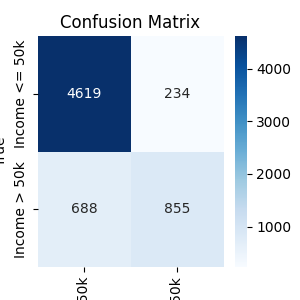
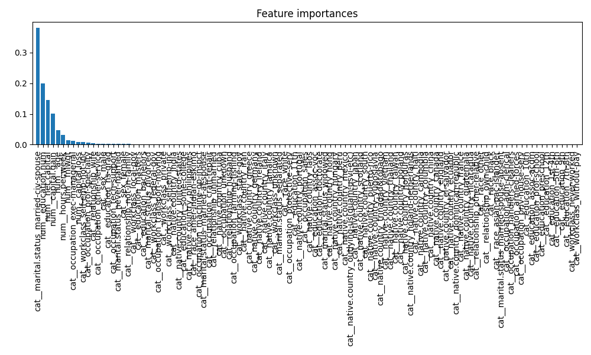
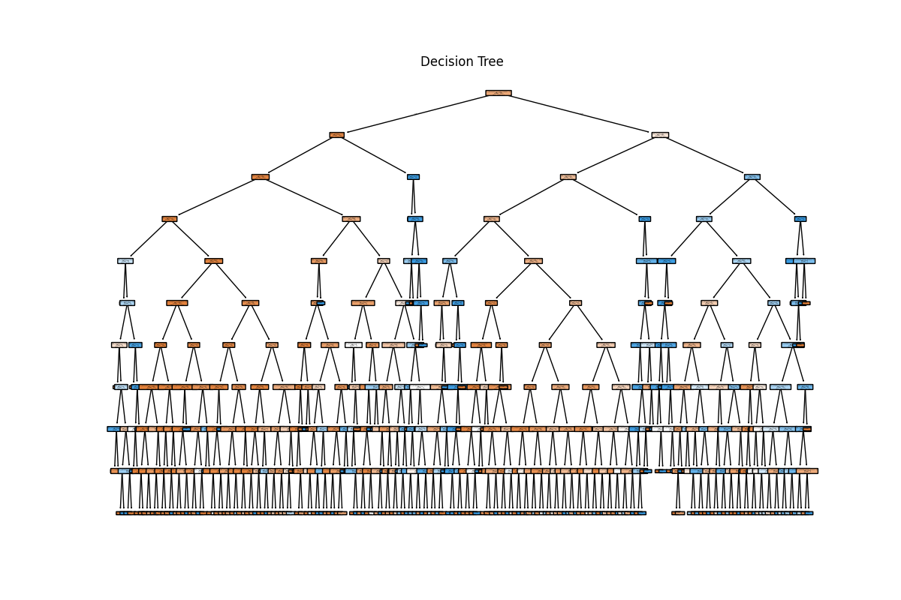
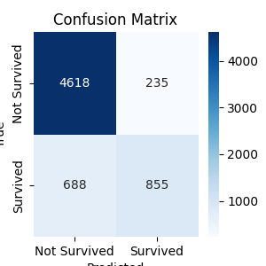
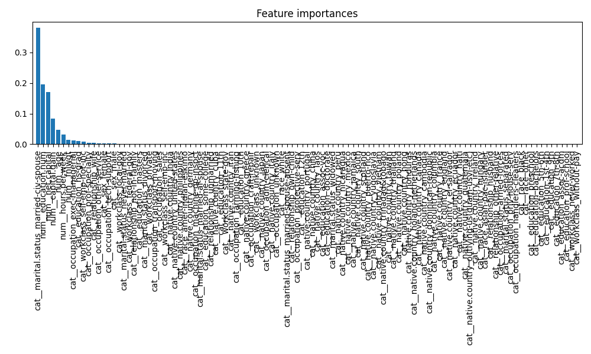
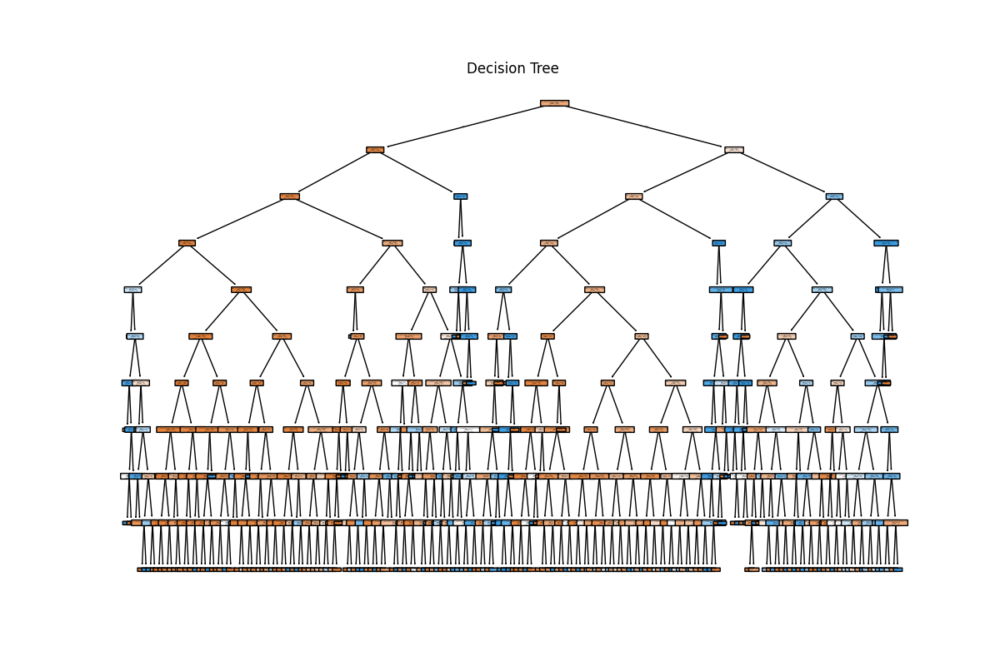

<!-- # To Do
- Create a conda environment to store the packages
- Export the data that you cleaned in the previous project (you can use your own cleaned data or someone else's) as a CSV file
- Load the data into a pandas dataframe
- Perform a test train split
- Use your favourite model to perform regression and get predictions on train data
- Report appropriate metrics
- Choose good hyperparameters
- Ensure best practices
- Work solo or in pairs
- Ensure that your code is well commented
- Create a jupyter notebook to document your work
- Create a README file to explain your project, your process, and your findings
- Create a requirements.txt file to document the packages you used
- Create a .gitignore file to ignore the data files
- Create a branch for your project on this repository

The best project will be merged into the main branch for showcase! Good luck! -->

# 💼 Income Classification Using Cleaned Demographic Data

This project applies a machine learning classification model to predict whether an individual's income exceeds $50K annually, based on demographic and employment-related features. Starting from a cleaned version of the well-known Adult Income dataset, the pipeline includes data preprocessing, feature engineering, model training with a Decision Tree classifier, performance evaluation, and model persistence. The project emphasizes clarity, reproducibility, and best practices in data science workflows.

---

## How to Run

1. Clone the repository.  
2. **Using Conda environment (recommended):**

    ```bash
    conda env create -f environment.yml
    conda activate my_env  # replace my_env with your env name

3. Run the python notebook in Jupyter Notebook or any compatible IDE.  
4. View the output graphs inside the `graphs/` folder.  

---

## Project Structure
### Phase 1: Baseline Model Development
**Approach:** Initial implementation without parameter optimization
**Graphs:**  
- Confusion Matrix:  
  
  **Observations:**
    - The model correctly classified 4,293 "Not Survived" and 945 "Survived" instances.
    - There are 560 false positives (predicted "Survived" but actually "Not Survived") and 598 false negatives (predicted "Not Survived" but actually "Survived").
    - The confusion matrix highlights a class imbalance, with more "Not Survived" cases than "Survived."
    - The model is more accurate at predicting the majority class ("Not Survived"), but struggles with the minority class ("Survived"), as shown by the higher number of false negatives.

- Feature Importance:  
    
  **Observations:**
    - A small number of features have high importance (close to 0.20), while most features contribute very little.
    - The majority of the one-hot encoded categorical features have near-zero importance, suggesting redundancy and potential for dimensionality reduction.
    - The most important features are likely key demographic or financial indicators, which dominate the model's decision-making process.

- Decision Tree:  
  
  **Observations:**
    - The tree is extremely deep and complex, with many branches and leaf nodes.
    - Such complexity is a sign of overfitting: the model may be memorizing training data patterns rather than generalizing.
    - This structure can lead to poor performance on new, unseen data and indicates the need for regularization or pruning in future steps.

**Key Metrics:**  
- Accuracy: 0.819
- Precision: 0.82
- Recall: 0.82
- F1 Score: 0.82
**Implementation Details:**  
- Used all available features (13 original columns)  
- Default Decision Tree parameters (unconstrained depth)  
- Basic preprocessing:  
  - Standard scaling for numerical features  
  - One-hot encoding for categorical variables  

---
### Phase 2: Hyperparameter Tuning
**Approach:** Introduced tree depth constraint  
**Graphs:**  
- Tuned Confusion Matrix:  
    
  **Observations:**
    - The model correctly predicts 4,619 "Not Survived" and 855 "Survived" cases.
    - False positives (predicting "Survived" when actually "Not Survived") are 234, and false negatives (predicting "Not Survived" when actually "Survived") are 688.
    - Compared to Phase 1, there is a notable reduction in false positives, indicating better precision for the "Survived" class.
    - The class imbalance persists, but the model's ability to identify the minority class ("Survived") has improved, as shown by the higher true positive count.
    - Overall, the confusion matrix suggests improved generalization and less overfitting after tuning.

- Simplified Feature Importance:  
  
  **Observations:**
    - The importance distribution is still skewed, but now even fewer features dominate the model's decisions.
    - The most important feature has an even higher relative importance (above 0.30), while most features remain near zero.
    - The reduction in the number of influential features suggests that hyperparameter tuning (e.g., limiting tree depth) has focused the model on the most predictive variables.
    - Many one-hot encoded categorical features continue to contribute little, reinforcing the opportunity for further feature selection.

- Simplified Decision Tree:  
  
  **Observations:**
    - The tree is noticeably shallower and less complex than in Phase 1, with fewer layers and splits.
    - This structural simplification is a direct result of setting a maximum depth (e.g., `max_depth=10`), which helps prevent overfitting.
    - The tree now generalizes better, making decisions based on broader patterns rather than memorizing specific data points.
    - The improved structure should lead to better performance on unseen data and increased model interpretability.

**Key Metrics:**  
- Accuracy: 0.856 (+4.6% improvement)  
- Precision: 0.85  
- Recall: 0.86 
- F1 Score: 0.85
**Changes Implemented:**  
Limited the decision tree depth to 10 levels, reducing overfitting and improving generalization.
---
### Phase 3: Feature Optimization
**Approach:** Feature selection based on importance thresholds  
**Graphs:**  
- Optimized Confusion Matrix:  
    
  **Observations:**
    - The model correctly predicts 4,618 "Not Survived" and 855 "Survived" cases.
    - There are 235 false positives (predicted "Survived" when actually "Not Survived") and 688 false negatives (predicted "Not Survived" when actually "Survived").
    - Compared to previous phases, the number of false positives is reduced and the number of true positives is maintained, indicating improved precision for the "Survived" class.
    - The confusion matrix demonstrates that the model maintains strong overall accuracy and handles class imbalance better after feature selection and tuning.
- Final Feature Importance:  
    
  **Observations:**
    - The importance distribution is even more focused, with a small number of features (roughly 5–8) contributing the majority of the predictive power.
    - Most one-hot encoded categorical features now have negligible or zero importance, confirming that dropping low-importance features was effective.
    - The top features are likely key demographic and financial variables, making the model more interpretable and efficient.
- Final Decision Tree:
  
  **Observations:**
    - The tree is relatively shallow and much less complex than in earlier phases.
    - The simplified structure is a result of both limiting tree depth and removing unimportant features.
    - This leads to better generalization, reduced risk of overfitting, and easier interpretation of decision paths.
    - The model now focuses on the most relevant variables, supporting robust and efficient predictions.


**Key Metrics:**  
- Accuracy: 0.855   
- Precision: 0.85 
- Recall: 0.86
- F1 Score: 0.85  

**Feature Selection Criteria:**  
- Removed features with <1% importance (marital.status, race, etc.)  
- Retained 8 core predictors:  
  - Numerical: age, capital.gain, education.num  
  - Categorical: workclass, occupation, relationship  

**Impact:**  
- Simplified model architecture  
- Reduced computational requirements  
- Maintained predictive performance  

---
## Conclusion
The model development process for income classification using decision trees progressed through three phases: baseline training, hyperparameter tuning, and feature masking (feature selection). Each phase contributed to a more robust and efficient model, with clear trade-offs observed in performance and complexity.

- **Phase 1 (Baseline):**  
  The initial model, trained without any hyperparameter tuning or feature selection, showed signs of overfitting and relied on a large number of features. While it achieved reasonable accuracy, the complexity of the tree and the inclusion of many low-importance features limited its generalizability.
- **Phase 2 (Hyperparameter Tuning):**  
  Introducing a maximum tree depth (`max_depth=10`) significantly improved the model's generalization ability. The accuracy increased to **0.856**, and the tree became more interpretable and less prone to overfitting. Feature importance became more concentrated among a smaller set of predictors, setting the stage for further optimization.
- **Phase 3 (Feature Masking/Selection):**  
  By removing features with very low importance (below a 1% threshold), the model was simplified further. This step made the model more efficient and interpretable, focusing only on the most relevant features.  
  However, this phase resulted in a very slight decrease in accuracy to **0.855** (from 0.856 in Phase 2). This minimal drop demonstrates that most of the pruned features were indeed redundant, and the core predictive power was retained by the remaining variables.
  **Key Takeaways:**
- The slight decrease in accuracy after feature masking is an expected and acceptable trade-off for improved model simplicity, interpretability, and efficiency.
- The decision tree model benefited most from hyperparameter tuning, with feature selection providing additional practical advantages at almost no cost to predictive performance.
- The final model is less complex, more robust to overfitting, and easier to deploy and maintain, while maintaining nearly the highest possible accuracy achieved during the process.

**In summary:**  
The modeling process successfully balanced performance and interpretability. The final model, after feature selection, is highly efficient and only marginally less accurate than the best-tuned version, validating the effectiveness of the feature masking approach in this context.